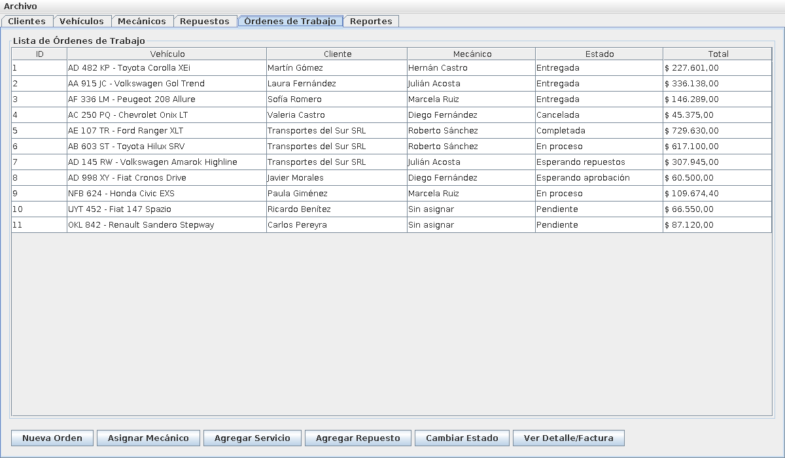
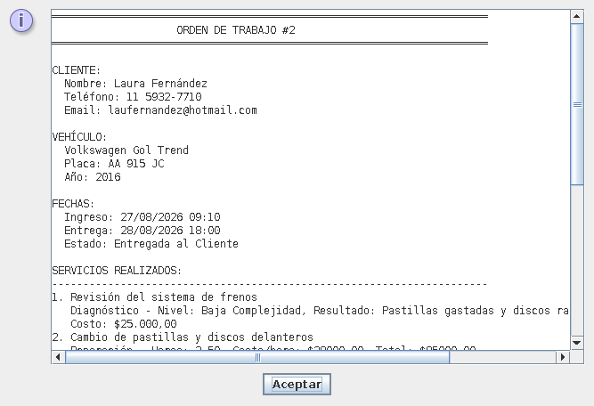
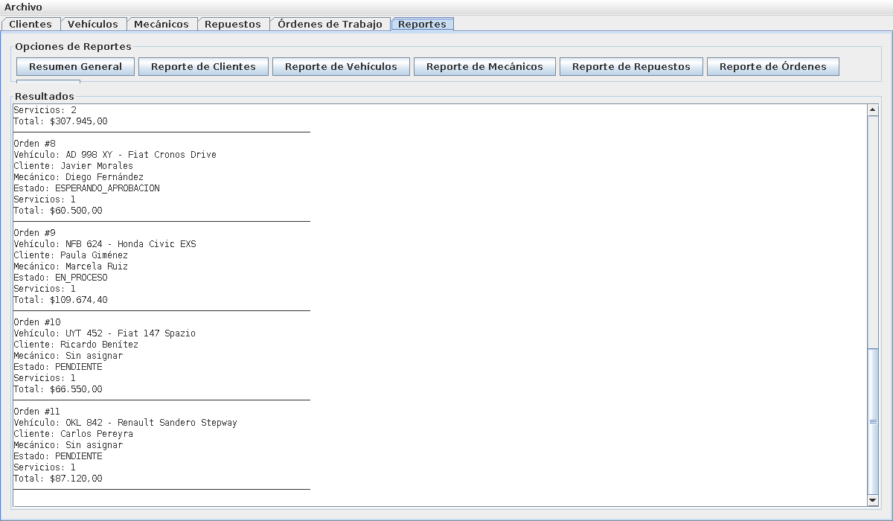

# Sistema de Gestión de Taller Mecánico 🔧

Aplicación de escritorio en **Java** para administrar un taller mecánico: clientes, vehículos, mecánicos, repuestos y órdenes de trabajo, con cálculo de costos, facturación y reportes.

Desarrollada como trabajo práctico de la carrera de Ingeniería en Informática en la **Universidad Argentina de la Empresa (UADE)**, aplicando el paradigma de programación orientada a objetos.

---

## Probala

🌐 **En el navegador, sin instalar nada:** [manununez1010.github.io/taller-mecanico](https://manununez1010.github.io/taller-mecanico/)

La aplicación de escritorio original corre directamente en el navegador gracias a [CheerpJ](https://cheerpj.com), una máquina virtual de Java hecha en WebAssembly. La primera carga puede tardar unos segundos, y los cambios se guardan automáticamente en el navegador de cada persona.

💻 **Como aplicación de escritorio:** descargá **TallerMecanico.jar** desde [Releases](https://github.com/manununez1010/taller-mecanico/releases/latest) y abrilo con doble clic. Requiere **Java 8 o superior** ([descarga gratuita](https://adoptium.net)).

En los dos casos la aplicación arranca con datos de ejemplo, que se pueden volver a cargar en cualquier momento desde **Archivo → Restaurar datos de ejemplo**.

---

## Funcionalidades

- **Clientes y vehículos:** alta, modificación y baja, con validación de datos.
- **Mecánicos:** gestión del personal, con control de mecánicos activos e inactivos.
- **Repuestos:** inventario con control de stock y proveedores.
- **Órdenes de trabajo:** asignación de vehículo y mecánico, carga de servicios y repuestos utilizados, y seguimiento por estados (pendiente, en proceso, esperando repuestos, esperando aprobación, completada, entregada, cancelada).
- **Tipos de servicio:** diagnóstico, mantenimiento, reparación y pintura, cada uno con sus propios datos y su propia forma de calcular el costo. Se eligen desde la interfaz con un formulario que cambia según el tipo.
- **Reglas de negocio:** al cancelar una orden los repuestos vuelven al stock, al terminar un trabajo el mecánico queda disponible otra vez y las órdenes cerradas no se pueden modificar.
- **Facturación:** detalle de cada orden con servicios, repuestos, subtotal, IVA y total (doble clic sobre una orden para verlo).
- **Reportes:** resumen general y reportes por clientes, vehículos, mecánicos, repuestos y órdenes.
- **Persistencia:** los datos se guardan en archivos JSON y se recuperan al volver a abrir la aplicación. En la versión web se guardan solos cada pocos segundos.

## Conceptos de programación orientada a objetos aplicados

- **Herencia:** `Persona` como clase abstracta base de `Cliente`, `Mecanico` y `Administrador`; `Servicio` como base de los distintos tipos de servicio.
- **Polimorfismo:** cada tipo de servicio redefine `calcularCostoTotal()` con su propia lógica de costos.
- **Interfaces:** `ICalculable` para todo lo que tiene un costo, e `IRepositorio<T>` como contrato genérico de acceso a datos.
- **Patrón DAO:** separación entre el modelo y la persistencia.
- **Enumeraciones:** `EstadoOrden` y `NivelComplejidad` para representar estados y niveles de forma segura.
- **Excepciones propias:** `StockInsuficienteException` y `MecanicoInactivoException` para las reglas de negocio.
- **Encapsulamiento y validaciones** en los constructores y métodos del modelo.

## Estructura del proyecto

```
src/main/java/
├── Main.java            # Punto de entrada
├── modelo/              # Clases del dominio (clientes, vehículos, órdenes, servicios...)
├── enums/               # Estados de las órdenes y niveles de complejidad
├── excepciones/         # Excepciones de reglas de negocio
├── persistencia/        # Guardado y lectura de datos en JSON
└── gui/                 # Interfaz gráfica (una pestaña por módulo)
src/main/resources/
└── datos-ejemplo/       # Datos de ejemplo incluidos dentro del programa
docs/                    # Versión web (página + programa compilado) publicada con GitHub Pages
capturas/                # Imágenes para este README
```

## Tecnologías

- **Java** (compatible desde Java 8 en adelante)
- **Swing** para la interfaz gráfica
- **Gson** para la serialización a JSON
- **Maven** para la gestión del proyecto y sus dependencias
- **CheerpJ** y **GitHub Pages** para publicar la versión web

## Cómo ejecutarlo

**Con IntelliJ IDEA (recomendado):** abrí la carpeta del proyecto, esperá a que Maven descargue las dependencias y ejecutá la clase `Main`.

**Desde la terminal** (con Java 8 o superior y Maven instalados):

```bash
mvn compile exec:java
```

Los datos se guardan en una carpeta `data/`, que se crea sola la primera vez que se abre la aplicación.

## Datos de ejemplo

El sistema viene con datos cargados para probarlo apenas se abre: un taller con 10 clientes, 12 vehículos, 5 mecánicos, 15 repuestos (algunos con bajo stock) y 11 órdenes de trabajo en todos los estados posibles, desde pendientes hasta entregadas y canceladas. Para volver a ellos, usá **Archivo → Restaurar datos de ejemplo**.

## Capturas

**Órdenes de trabajo**



**Detalle de una orden**



**Reportes**



## Autor

**Manuel Núñez** · [GitHub](https://github.com/manununez1010)
